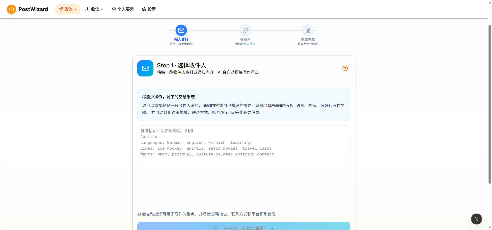
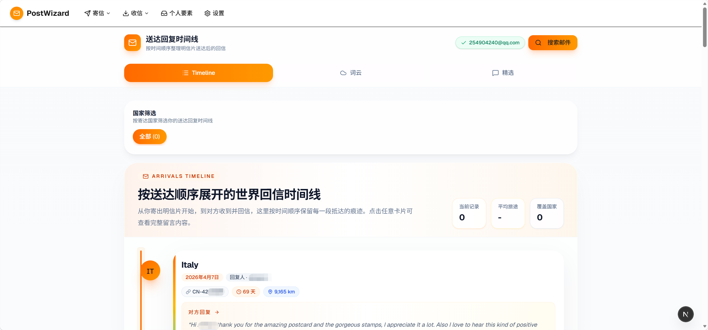
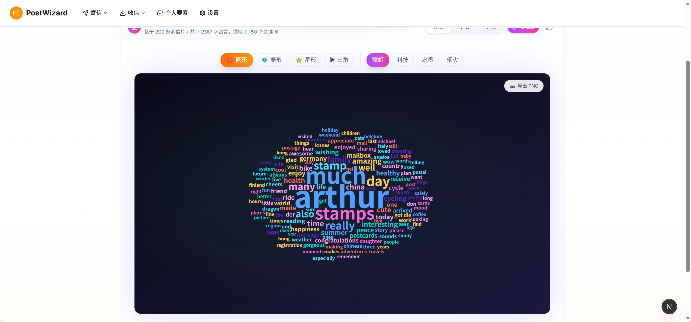

<div align="center">


# PostWizard Lite ✨

**开源版 · 明信片智能收寄信助手**

<p align="center">
  <a href="#-功能特性">功能特性</a> •
  <a href="#-快速开始">快速开始</a> •
  <a href="#-技术栈">技术栈</a> •
  <a href="#-截图预览">截图预览</a> •
  <a href="#-开发文档">开发文档</a>
</p>

<p align="center">
  
  
  
  
  
</p>

<p align="center">
  
  
  
</p>

</div>

---

## 🎯 一句话介绍

基于 AI 的明信片收、寄信助手。
寄信：分析收件人兴趣、自动生成个性化明信片内容，解决不知道写什么的苦恼；抓取邮箱中的他人注册时的回复，自动生成Timeline、词云、精选留言。
收信：识别难以辨认的手写内容、趣味抽卡评价明信片

---

## ✨ 功能特性

### 📮 寄信流程
- **📋 粘贴解析** — 直接粘贴邮件文本，智能提取收件人信息，根据收件人画像自动生成个性化英文内容
- **📧 邮件解析** — IMAP 自动抓取收件人信息邮件，一键识别（和粘贴解析二选一即可）
- **📜 历史记录** — 管理所有待寄和已寄明信片
- **✍️ 送达回复** — 抓取邮箱中的他人注册时的回复，自动生成Timeline、词云、精选留言。

### 📬 收信流程
- **📷 上传识别** — 上传明信片照片，OCR 自动识别文字
- **🗂️ 收信历史** — 整理所有收到的明信片
- **🖼️ 图片处理** — 自动裁剪、增强、旋转图片（优化中）

### 🎮 特色功能
- **🎴 收片抽卡菜单** — AI 分析明信片内容，评定内容真诚度+号码lucky值（SSR/SR/R/N）并生成多维评分
- **👤 个人要素** — 个人简介中英双语管理，让收信人感受到真实的你！
- **📊 收信分析** — 送达回复追踪、词云、精选留言
- **🖨️ 打印功能** — A4 批量打印版，带剪切线


---

## 🚀 快速开始

### 1. 克隆项目

```bash
git clone https://github.com/arthurfsy2/PostWizard-lite.git
cd PostWizard-lite
```

### 2. 安装依赖

```bash
npm install
```

### 3. 配置数据库

开源版使用 SQLite，无需额外配置。数据库文件 `dev.db` 会在首次运行时自动创建。

```bash
# 生成 Prisma Client
npm run db:generate

# 推送数据库结构
npm run db:push
```

### 4. 配置 AI API

创建 `.env.local` 文件：

```bash
# OpenAI 兼容 API（必需）
OPENAI_API_KEY=your-api-key
OPENAI_BASE_URL=https://api.openai.com/v1

# 可选：禁用 Prisma 查询日志
DISABLE_PRISMA_QUERY_LOGS=true
```

> 💡 **提示**：启动后也可访问 `/settings` 页面在网页中配置

### 5. 启动开发服务器

```bash
npm run dev
```

访问 http://localhost:3000

---

## ⚠️ 安全提示

**当前版本不建议部署到 Vercel 等公开环境！**

- 🔒 **原因**：开源版为简化部署，默认**无用户认证系统**，所有数据公开可访问
-  **风险**：部署到 Vercel 后，你的明信片数据、邮件配置等可能被他人访问
- 💡 **推荐用法**：
  - ✅ 本地开发环境运行（`npm run dev`）
  - ✅ 私有服务器部署（需自行配置认证）

**下一版本计划**：
- 添加可选的管理员登录功能（通过环境变量控制开关，默认关闭）
- 支持安全的 Vercel 部署

**临时解决方案**（如必须部署）：
- 使用 Vercel 的 [Deployment Protection](https://vercel.com/docs/deployment-protection) 功能
- 或通过 [Vercel Authentication](https://vercel.com/guides/adding-password-protection-to-nextjs) 添加密码保护

---

## 📁 项目结构

```
src/
├── app/                  # Next.js App Router 页面
│   ├── arrivals/         # 送达回复追踪
│   ├── emails/           # 邮件解析
│   ├── materials/        # 素材库
│   ├── received/         # 收信管理
│   ├── sent/             # 寄信管理
│   ├── profile/          # 个人要素
│   ├── settings/         # 设置
│   └── api/              # API 路由
├── components/           # UI 组件
│   ├── ui/               # 基础组件 (shadcn/ui)
│   ├── gacha/            # 抽卡系统
│   └── ...
├── lib/                  # 工具库 & 服务
├── hooks/                # React Hooks
└── types/                # TypeScript 类型定义
```

---

## 🛠️ 技术栈

| 类别 | 技术 |
|------|------|
| **框架** | Next.js 16 (App Router) |
| **语言** | TypeScript / React 19 |
| **样式** | Tailwind CSS 4 |
| **数据库** | SQLite (Prisma ORM) |
| **状态管理** | Zustand |
| **数据获取** | TanStack Query + SWR |
| **AI** | OpenAI 兼容 API |
| **OCR** | Tesseract.js |
| **测试** | Vitest + Playwright |
| **部署** | Vercel |

---

## 📸 截图预览

<div align="center">

| AI 解析收件人 | 收信智能评价 |
|:-------------:|:------------:|
|  |  |

| 送达时间线 | 词云分析 |
|:----------:|:--------:|
|  |  |

</div>

---

## 🧪 开发脚本

```bash
# 开发
npm run dev              # 启动开发服务器
npm run dev:uat          # 启动 UAT 环境 (端口 3001)

# 测试
npm run test             # 运行单元测试
npm run test:coverage    # 生成测试覆盖率报告
npm run test:e2e         # 运行 E2E 测试

# 代码质量
npm run lint             # ESLint 检查
npm run check:tech-debt  # 检查技术债务
npm run check:local-user # 检查 userId 本地化

# 数据库
npm run db:generate      # 生成 Prisma Client
npm run db:push          # 推送数据库结构
npm run db:migrate       # 运行数据库迁移

# 部署
npm run build            # 构建生产版本
npm run start            # 启动生产服务器
```

---

## 🌟 Star History

<a href="https://star-history.com/#arthurfsy2/PostWizard-lite&Date">
  <picture>
    <source media="(prefers-color-scheme: dark)" srcset="https://api.star-history.com/svg?repos=arthurfsy2/PostWizard-lite&type=Date&theme=dark" />
    <source media="(prefers-color-scheme: light)" srcset="https://api.star-history.com/svg?repos=arthurfsy2/PostWizard-lite&type=Date" />
    
  </picture>
</a>

---

## 🤝 贡献

欢迎提交 Issue 和 Pull Request！

1. Fork 本项目
2. 创建你的特性分支 (`git checkout -b feature/AmazingFeature`)
3. 提交更改 (`git commit -m 'Add some AmazingFeature'`)
4. 推送到分支 (`git push origin feature/AmazingFeature`)
5. 打开一个 Pull Request

---

## 📄 许可证

[MIT](./LICENSE) © 2025 PostWizard

---

<div align="center">

**用 ❤️ 和 🎴 制作**

<p>
  <a href="https://github.com/arthurfsy2/PostWizard-lite/stargazers">⭐ Star 支持我们</a> •
  <a href="https://github.com/arthurfsy2/PostWizard-lite/issues">🐛 报告问题</a> •
  <a href="https://github.com/arthurfsy2/PostWizard-lite/discussions">💬 参与讨论</a>
</p>

</div>
