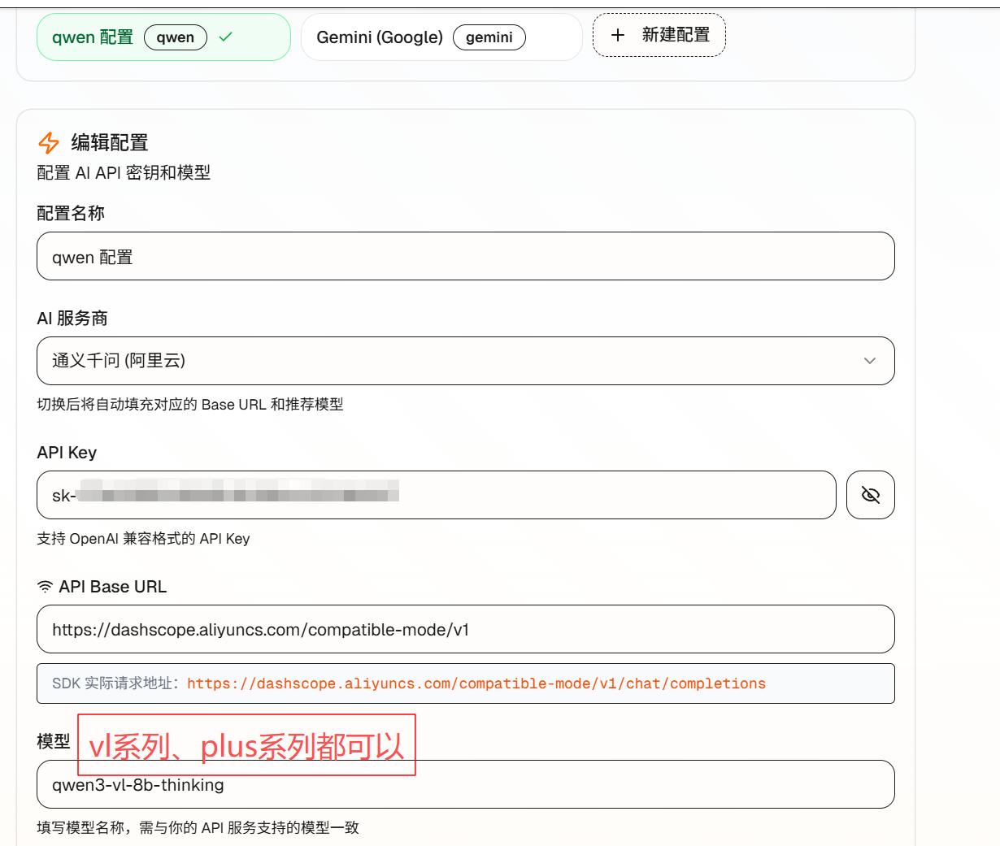
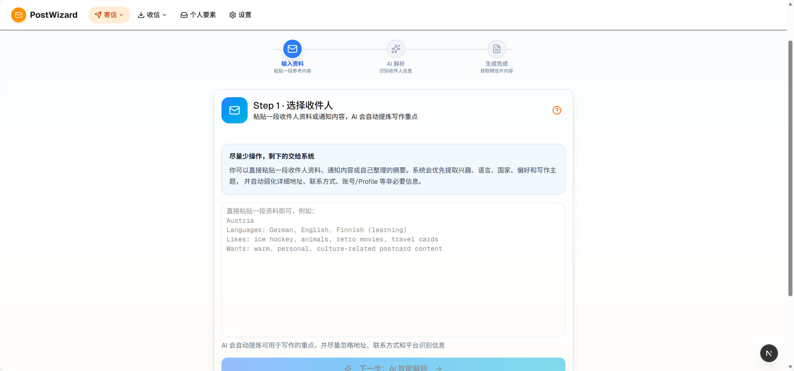
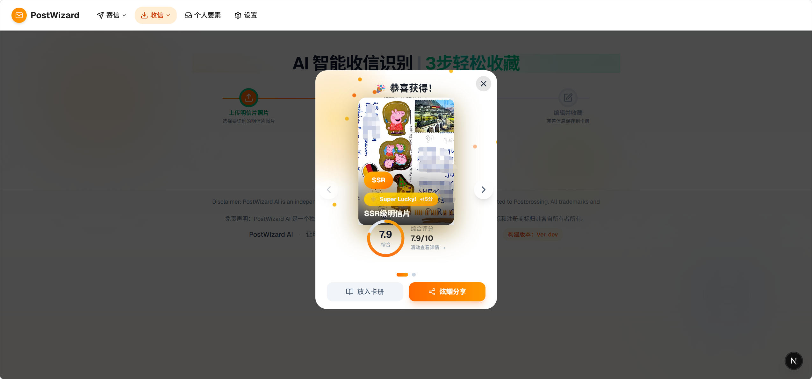
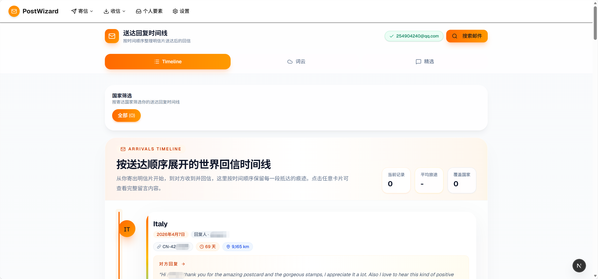
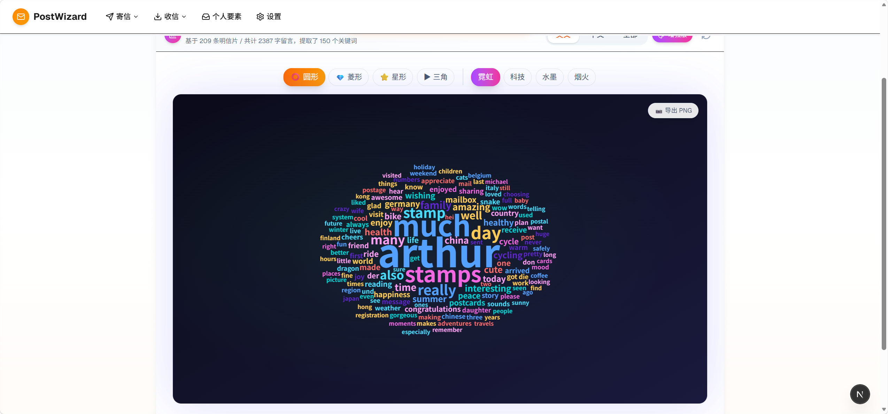

<p align="center">
  <a href="README.md">English</a> | <a href="README_CN.md">中文说明</a>
</p>

<div align="center">


# PostWizard Lite ✨

**Open Source · AI-Powered Postcrossing Assistant**

<p align="center">
  <a href="#-features">Features</a> •
  <a href="#-getting-started">Getting Started</a> •
  <a href="#-tech-stack">Tech Stack</a> •
  <a href="#-screenshots">Screenshots</a>
</p>

<p align="center">
  
  
  
  
  
</p>

<p align="center">
  
  
  
</p>

</div>

---

## 🎯 Overview

An AI-powered postcard assistant for sending and receiving.
**Sending**: Analyze recipient interests, auto-generate personalized postcard content — no more staring at a blank card. Fetch arrival replies from your mailbox and build timelines, word clouds, and highlight reels.
**Receiving**: OCR hard-to-read handwriting, rate received cards with fun gacha mechanics.

> 💡 **Project Origin**: This open-source version contains core features from [PostWizard Full Version](https://postwizard.cn) (supports user registration, multi-user management, donations, feedback, help, etc.). This is a simplified, self-hosted open-source edition.

---

## ✨ Features

### 📮 Sending

- **📋 Paste & Parse** — Paste email text to auto-extract recipient info and generate personalized English content
- **📧 Email Parse** — IMAP auto-fetch recipient emails, one-click parsing
- **📜 History** — Manage all pending and sent postcards
- **✍️ Arrivals Timeline** — Fetch arrival replies from your mailbox, auto-generate timelines, word clouds, and highlights

### 📬 Receiving

- **📷 Upload & OCR** — Upload postcard photos, auto-recognize handwritten text
- **🗂️ Gallery** — Organize all received postcards
- **🖼️ Image Processing** — Auto-crop, enhance, rotate images (work in progress)

### 🎮 Special Features

- **🎴 Card Gacha** — AI analyzes postcard content, rates sincerity + lucky number (SSR/SR/R/N) with multi-dimensional scoring
- **👤 Profile** — Manage your bilingual bio so recipients get to know the real you!
- **📊 Analytics** — Arrival tracking, word clouds, highlight reels
- **🖨️ Print** — A4 batch printing with cut lines

---

## 🚀 Getting Started

### 1. Clone

```bash
git clone https://github.com/arthurfsy2/PostWizard-lite.git
cd PostWizard-lite
```

### 2. Install Dependencies

```bash
npm install
```

### 3. Database Setup

This edition uses SQLite — no extra configuration needed. The `dev.db` file is auto-created on first run.

```bash
# Generate Prisma Client
npm run db:generate

# Push database schema
npm run db:push
```

### 4. Configure AI API

#### Option A: Environment Variables (Recommended)

Create `.env.local`:

```bash
# OpenAI-compatible API (required, fallback for web config)
DASHSCOPE_API_KEY=your-api-key
AI_BASE_URL=https://dashscope.aliyuncs.com/compatible-mode/v1
AI_MODEL=qwen3.6-plus

# Optional: Enable admin password protection
ADMIN_PASSWORD=your-strong-password

# Optional: Disable Prisma query logging
DISABLE_PRISMA_QUERY_LOGS=true
```

> The `ENCRYPTION_KEY` is **auto-generated on first run** and written to `.env.local` — no manual setup needed.

#### Option B: Web Configuration

After starting, visit `/settings` to configure API Key, Base URL, and model.



**Advanced Features**:

- **Per-purpose configuration**: Assign different models/providers for OCR and text analysis. For example, use Qwen-VL for image recognition and DeepSeek for text analysis. Select "Images Only" or "Text Only" in the config settings.
- **Proxy settings**: To access overseas services like Gemini, configure a proxy address (e.g. `127.0.0.1:7890`). US, Japan, or Singapore nodes are recommended — Hong Kong nodes may not be supported by some APIs.

---

## 🔑 API Key Guide

### Alibaba Cloud Bailian (Recommended · Generous Free Tier)

Alibaba Cloud Bailian offers **free trial credits** with vision models suitable for postcard OCR.

**Steps**:
1. Visit [Alibaba Cloud Bailian Console](https://bailian.console.aliyun.com/)
2. Register/Login
3. Go to "Model Plaza" → Select **Qwen-VL-Max** or **Qwen-VL-Plus**
4. Enable the service and claim free credits
5. Create an API Key: "API-KEY Management" → Create New

**Configuration**:
```bash
DASHSCOPE_API_KEY=sk-xxxxxxxxxxxxxxxxxxxxxxxx
AI_BASE_URL=https://dashscope.aliyuncs.com/compatible-mode/v1
AI_MODEL=qwen3-vl-8b-thinking
```

> 💡 **Tips**:
> - Free tier: ~1M tokens (check official site for details)
> - Must select a **Qwen-VL** model for image recognition (e.g. `qwen3-vl-8b-thinking`)
> - SDK endpoint: `https://dashscope.aliyuncs.com/compatible-mode/v1/chat/completions`

### Other Providers

You can also use any OpenAI-compatible API:
- **OpenAI Official**: `https://api.openai.com/v1`
- **DeepSeek**: `https://api.deepseek.com/v1`
- **Google Gemini**: `https://generativelanguage.googleapis.com/v1beta/openai` (proxy required) ⭐ Recommended — accurate English handwriting recognition, fast response on paid tiers
- **Zhipu AI**: `https://open.bigmodel.cn/api/paas/v4`
- **Self-hosted**: Ollama, vLLM, etc.

### 5. Start Dev Server

```bash
npm run dev
```

Visit http://localhost:3001

---

## ⚠️ Security Notes

Default is **no authentication** — suitable for local development and private networks.

### Enable Admin Login

For public deployment, set `ADMIN_PASSWORD` in your environment:

```bash
# .env.local
ADMIN_PASSWORD=your-strong-password
```

> **Restart the server** after changing the password.

- ✅ When set: all pages require password login
- ⬜ When unset: no authentication, behavior unchanged
- Login state is maintained via httpOnly Cookie for 7 days

---

## 📁 Project Structure

```
src/
├── app/                    # Next.js App Router
│   ├── [locale]/           # Localized pages (en/zh)
│   ├── api/                # API routes
│   └── ...
├── components/             # UI components
│   ├── ui/                 # Base components (shadcn/ui)
│   ├── gacha/              # Card gacha system
│   └── ...
├── lib/                    # Utilities & services
├── hooks/                  # React Hooks
├── i18n/                   # Internationalization config
├── messages/               # Translation files (en.json, zh.json)
└── types/                  # TypeScript type definitions
```

---

## 🛠️ Tech Stack

| Category           | Technology                   |
| ------------------ | ---------------------------- |
| **Framework**      | Next.js 16 (App Router)      |
| **Language**       | TypeScript / React 19        |
| **Styling**        | Tailwind CSS 4               |
| **Database**       | SQLite (Prisma ORM)          |
| **State Mgmt**     | Zustand                      |
| **Data Fetching**  | TanStack Query + SWR         |
| **AI**             | OpenAI-compatible API        |
| **OCR**            | Tesseract.js                 |
| **i18n**           | next-intl                    |
| **Testing**        | Vitest + Playwright          |
| **Deployment**     | Local / Private Server       |

---

## 📸 Screenshots

<div align="center">

|            AI Parse Recipient            |              Card Rating              |
| :--------------------------------------: | :-----------------------------------: |
|  |  |

|              Arrivals Timeline              |               Word Cloud               |
| :-----------------------------------------: | :------------------------------------: |
|  |  |

</div>

---

## 🧪 Dev Scripts

```bash
# Development
npm run dev              # Start dev server
npm run dev:uat          # UAT environment (port 3002)

# Testing
npm run test             # Unit tests
npm run test:coverage    # Coverage report
npm run test:e2e         # E2E tests

# Code Quality
npm run lint             # ESLint
npm run check:tech-debt  # Tech debt check
npm run check:local-user # UserId localization check

# Database
npm run db:generate      # Generate Prisma Client
npm run db:push          # Push schema
npm run db:migrate       # Run migrations

# Deploy
npm run build            # Production build
npm run start            # Start production server
```

---

## 🌟 Star History

<a href="https://star-history.com/#arthurfsy2/PostWizard-lite&Date">
  <picture>
    <source media="(prefers-color-scheme: dark)" srcset="https://api.star-history.com/svg?repos=arthurfsy2/PostWizard-lite&type=Date&theme=dark" />
    <source media="(prefers-color-scheme: light)" srcset="https://api.star-history.com/svg?repos=arthurfsy2/PostWizard-lite&type=Date" />
    
  </picture>
</a>

---

## 🤝 Contributing

Issues and Pull Requests are welcome!

1. Fork the project
2. Create your feature branch (`git checkout -b feature/AmazingFeature`)
3. Commit your changes (`git commit -m 'Add some AmazingFeature'`)
4. Push to the branch (`git push origin feature/AmazingFeature`)
5. Open a Pull Request

---

## 📄 License

[MIT](./LICENSE) © 2025 PostWizard

---

<div align="center">

**Made with ❤️ and 🎴**

<p>
  <a href="https://github.com/arthurfsy2/PostWizard-lite/stargazers">⭐ Star us</a> •
  <a href="https://github.com/arthurfsy2/PostWizard-lite/issues">🐛 Report issues</a> •
  <a href="https://github.com/arthurfsy2/PostWizard-lite/discussions">💬 Discussions</a>
</p>

</div>
